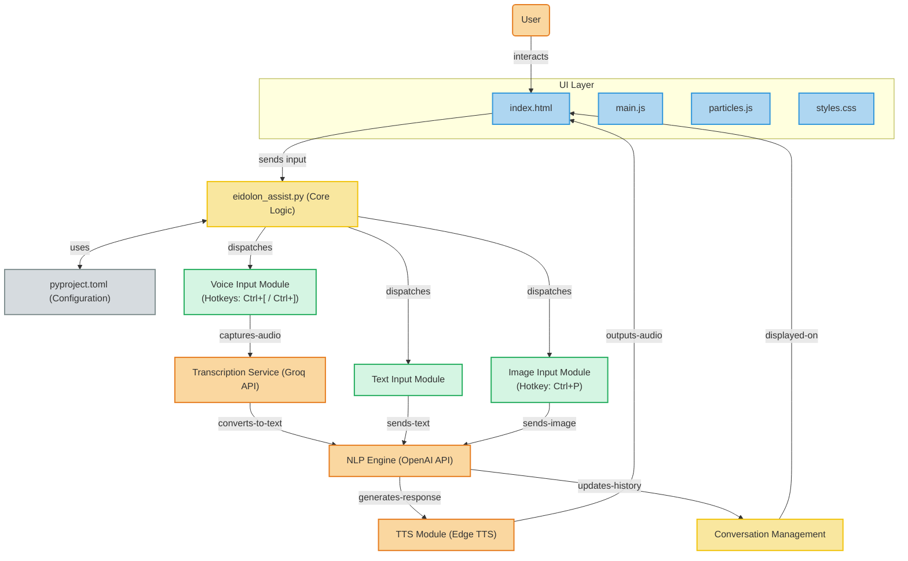

# Eidolon Assist

A personal assistant with voice and image capabilities, featuring a modern UI with rounded corners, gradients, and blur effects.

## Features

- **Voice Input**: Press Ctrl+[ to start recording and Ctrl+] to stop recording and process your request
- **Text Input**: Type your query directly in the text input area
- **Screenshot Capture**: Press Ctrl+P to capture a screenshot to include with your query
- **Text-to-Speech**: Hear responses through high-quality Edge TTS with adjustable speed and volume
- **Multimodal Processing**: Combine voice, text, and images in your queries
- **Seamless Conversation Flow**: Optimized for natural interaction with sentence-by-sentence TTS
- **Conversation History**: Keep track of your interactions with the AI and start new conversations anytime
- **Customizable Settings**: Configure API keys, models, voice, hotkeys and more

## Diagram


## Requirements

- Python 3.12+
- PyQt6
- Groq API key (for Whisper transcription)
- OpenAI-compatible API key (for language model responses)

## Installation

1. Clone this repository
2. Install the required packages using uv:

```
uv pip install -e .
```

Or alternatively:

```
pip install -e .
```

3. Run the application:

```
python eidolon_assist.py
```

## Configuration

On first run, open the Settings dialog to configure:

1. API Keys:
   - Groq API Key for audio transcription
   - OpenAI-compatible API Key and Base URL for AI responses

2. Models:
   - Whisper model for transcription
   - LLM model for AI responses (supports Gemini, Deepseek, GPT and other OpenAI-compatible models)

3. TTS Voice:
   - Choose from various Edge TTS voices
   - Adjust speech speed (+/-50%)
   - Customize volume level

4. Hotkeys:
   - Customize keyboard shortcuts for recording, screenshots, and TTS control

5. General:
   - Select microphone input device
   - Set conversation history limit
   - Customize system prompt for AI personality

## Hotkeys

- **Ctrl+[**: Start recording
- **Ctrl+]**: Stop recording and process
- **Ctrl+P**: Take a screenshot
- **Ctrl+\\**: Delete last screenshot
- **Ctrl+'**: Stop TTS playback

## Usage Tips

1. **Voice Commands**: Start recording with Ctrl+[ and speak your query. Stop with Ctrl+].
2. **Mixed Input**: Use screenshots and voice/text together for multimodal queries.
3. **Text Input**: Type questions directly when voice input isn't needed.
4. **Sentence-by-Sentence TTS**: The assistant speaks each sentence as it's generated for a more natural experience.
5. **New Conversation**: Start fresh with the "New Conversation" button when changing topics.
6. **Settings**: Configure your API keys before first use.

## Advanced Features

- **Parallel TTS Processing**: Behind-the-scenes optimization for smoother voice responses
- **Responsive UI**: Modern interface with blur effects and gradients
- **Image Analysis**: Submit screenshots for AI visual processing
- **Custom System Prompt**: Tailor the assistant's personality and capabilities
